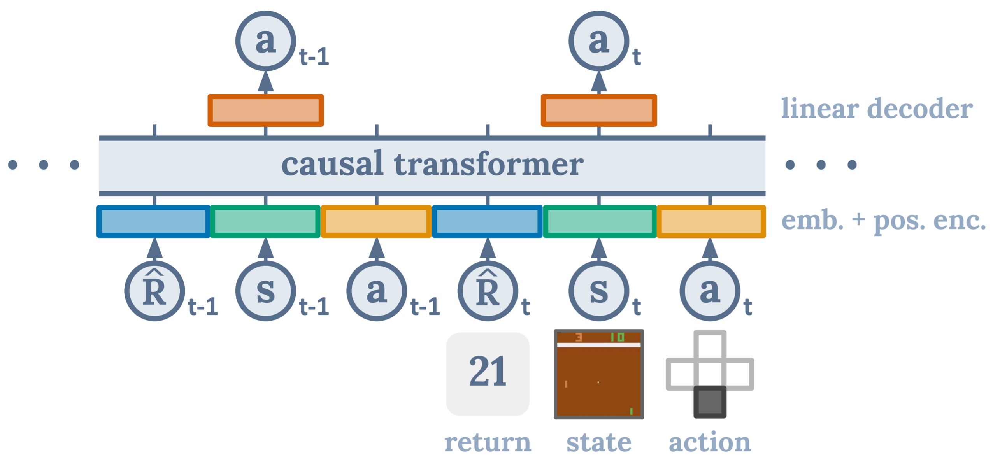

# Small-LLM (Locomotion Language Model)

### Q: Can pre-trained textual language models efficiently learn physical locomotion dynamics? 

Animals have knowledge regarding physics and locomotion

<div align="center">
  
  
  <br>
  <em>Giraffe walking &nbsp;&nbsp;&nbsp;&nbsp;&nbsp;&nbsp;&nbsp;&nbsp;&nbsp;&nbsp;&nbsp;&nbsp;&nbsp;&nbsp;&nbsp;&nbsp;&nbsp;&nbsp;&nbsp;&nbsp;&nbsp;&nbsp;&nbsp;&nbsp;&nbsp;&nbsp;&nbsp;&nbsp;&nbsp;&nbsp;&nbsp;&nbsp;&nbsp;&nbsp;&nbsp;&nbsp;&nbsp;&nbsp;&nbsp;&nbsp;&nbsp;&nbsp;&nbsp;&nbsp; RL Gym Cheetah</em>
</div>

## (1) RAG In Context Learning + Closed Loop Control

**System prompt:** You are an expert Mujoco Half Cheetah V0 environment controller.

```
Dynamic Prompt: 
"Time step {t}. HalfCheetah-v0 state vector has dimension 17. 
Current state: {state_list}.
Here are similar states to the current state and their corresonding actions to take you should use as a reference:
Similar state: {near_state} : action {near_action}...

Respond in strict JSON: {\"action\": [f1, f2, f3, f4, f5, f6]}. No extra text."
```

<div align="center">
  
</div>

### Demo Videos

<p align="center">
<table>
  <tr>
    <td align="center">
      
    </td>
    <td align="center">
      
    </td>
    <td align="center">
      
    </td>
  </tr>
</table>
</p>


## (2) Fine-tuned small LLM (Pythia-410M)

We freeze the entire model and only train linear encoder and decoder layers (4M trainable params)

<div align="center">
  
</div>

### Demo Videos with Different Reward Conditions

<p align="center">
<table>
  <tr>
    <td align="center">
      <h4>Reward Target: 600</h4>
      
    </td>
    <td align="center">
      <h4>Reward Target: 1200</h4>
      
    </td>
    <td align="center">
      <h4>Reward Target: 2400</h4>
      
    </td>
  </tr>
</table>
</p>

## (3) Train GPT2 from scratch

Following *Decision Transformer (Chen et al. 2021)*, train GPT2 decoder model (700K params)

<div align="center">
  
</div>

### Demo Videos with Different Reward Conditions

<p align="center">
<table>
  <tr>
    <td align="center">
      <h4>Reward Target: 300</h4>
      
    </td>
    <td align="center">
      <h4>Reward Target: 600</h4>
      
    </td>
    <td align="center">
      <h4>Reward Target: 1200</h4>
      
    </td>
  </tr>
</table>
</p>


## Evaluation Comparison

Comparison on fine-tuned frozen LLM with GPT trained from scratch

<div align="center">
  
</div>

## Conclusion

<div align="center">
  
  
  <br>
  <em>Giraffe walking &nbsp;&nbsp;&nbsp;&nbsp;&nbsp;&nbsp;&nbsp;&nbsp;&nbsp;&nbsp;&nbsp;&nbsp;&nbsp;&nbsp;&nbsp;&nbsp;&nbsp;&nbsp;&nbsp;&nbsp;&nbsp;&nbsp;&nbsp;&nbsp;&nbsp;&nbsp;&nbsp;&nbsp;&nbsp;&nbsp;&nbsp;&nbsp;&nbsp;&nbsp;&nbsp;&nbsp;&nbsp;&nbsp;&nbsp;&nbsp;&nbsp;&nbsp;&nbsp;&nbsp; RL Gym Cheetah</em>
</div>

## Usage

```python
# RAG with GPT approach
from gpt_wrapper.rag import rag_with_gpt
from visualize import replay_offscreen

# Generate trajectories
np_actions = rag_with_gpt(max_steps=40)

# Visualize as video
replay_offscreen('mujoco/halfcheetah/expert-v0', np_actions, 
                out_path="saved_vids/ragwrapper_cheetah.mp4")
```

```python
# Fine-tuned Pythia approach
from visualize import viz_driver

# Condition on target reward
viz_driver("pythia", target_rew=300)
```

```python
# Decision Transformer approach
from visualize import viz_driver

# Condition on target reward
viz_driver("dt", target_rew=300)
```
